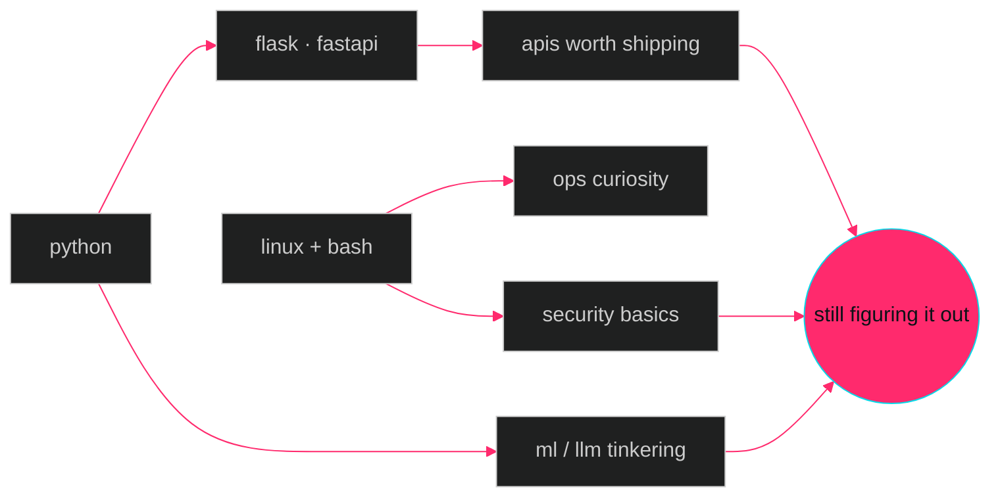

<!--
  so you opened the source. ok — vibe check passed.
  nothing here but a guy who builds things, lifts weights,
  and thinks the cyberpunk future arrived but forgot the cool jackets.

  if you scrolled here looking for secrets:
  the secret is just showing up.
-->

<div align="center">


<a href="#"></a>

</div>

---

### `$ ./sagar --status`

```yaml
boot:        ok
posture:     curious
homebase:    /dev/kichha
heading:     berlin.de            # eventually
stack:       python · flask · react · bash
learning:    linux internals · system design · whatever's interesting
training:    PPL · 6 days/wk · the gym is also a terminal
sleep:       deprecated since q3
fav_quote:   "what gets measured gets improved" — drucker
```

---

### `$ open --neural`

<details>
<summary><b>📡 currently_jacked_into.log</b></summary>

<br/>

- 🔴  **OverTheWire Bandit** → climbing slowly, learning a lot more than the level number implies
- 🟡  **system-design-lab** → URL Shortener · Rate Limiter · Task Queue · Chat · Autocomplete
- 🟢  *reading:* Designing Data-Intensive Applications
- ⚪  *side experiments:* local LLMs, because it's the era and it's fun
- ⚪  *watching:* IppSec at 1.5x with a terminal open and zero shame

</details>

<details>
<summary><b>🧠 neural_profile.yaml</b></summary>

```yaml
codename:     nullsector
focus:        building things, getting better at them
philosophy:   digital self-sufficiency > digital convenience
inspirations: [ghost_in_the_shell, altered_carbon, neuromancer]
ink:          ouroboros (work in progress)
training:     PPL · 6 days/wk · cutting honestly
hot_take: |
  the best devs i know read more docs than tutorials.
  i'm working on it.
```

</details>

<details>
<summary><b>⚠️ compile_errors.log</b></summary>

```log
[WARN]  deadline.exe consuming 87% CPU
[INFO]  caffeine levels: nominal
[ERROR] sleep.service: failed to start (recurring)
[FATAL] free_time.dll: not found  — retry post-Berlin
[ OK ]  bicep_curl.service: active (running)
```

</details>

---

### `$ ls /usr/local/skills/`

<div align="center">


<br/><br/>

<sub><i>and a healthy distrust of every API i didn't write myself</i></sub>

</div>

---

### `$ neural-graph --render`



---

### `$ cat /proc/github/stats`

<div align="center">


<br/>


<br/><br/>


</div>

---

### `$ tail -f activity.log`

<div align="center">


</div>

---

### `$ ./snake --eat-contributions`

<!-- theme-aware image: auto-swaps with your reader's github theme -->
<div align="center">

<picture>
  <source media="(prefers-color-scheme: dark)" srcset="https://raw.githubusercontent.com/GodSagar007/GodSagar007/output/github-contribution-grid-snake-dark.svg" />
  <source media="(prefers-color-scheme: light)" srcset="https://raw.githubusercontent.com/GodSagar007/GodSagar007/output/github-contribution-grid-snake.svg" />
  
</picture>

</div>

---

<div align="center">


<br/><br/>


&nbsp;
<a href="mailto:[your-email]"></a>
&nbsp;
<a href="https://www.linkedin.com/in/[your-handle]"></a>

</div>


<!--
  ouroboros.exe is running.
  if you scrolled all the way here, you already know:
  the best work is the work nobody asked you to do.
-->
