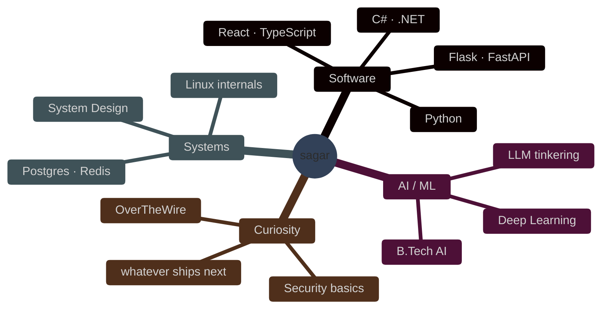

<!--
  so you opened the source. ok — vibe check passed.
  nothing here but an engineer who likes the cyberpunk aesthetic
  more than the cyberpunk attitude. building things, shipping
  some, reading the docs for the rest.

  if you scrolled here looking for secrets:
  the secret is showing up. preferably twice.
-->

<div align="center">


<a href="#"></a>

</div>

---

### `$ ./sagar --status`

```yaml
education:      B.Tech, Artificial Intelligence
shipped_at:     Saxo Bank — backend (C# / .NET)
stack:          python · c# · .net · react · flask · postgres
also_in_orbit:  linux · system design · security fundamentals
heading:        berlin.de            # eventually
posture:        curious — broadly, deeply
fav_quote:      "what gets measured gets improved" — drucker
```

---

### `$ ls /usr/local/skills/`

<div align="center">


<br/><br/>

<sub><i>plus a healthy distrust of every API i didn't write myself</i></sub>

</div>

---

### `$ render --mindmap`



---

### `$ open ~/about`

<details>
<summary><b>📡 currently_building.log</b></summary>

<br/>

- 🔴  **system-design-lab** → URL Shortener · Rate Limiter · Task Queue · Chat · Autocomplete
- 🟡  Side experiments with local LLMs — because it's the era and it's fun
- 🟢  *reading:* Designing Data-Intensive Applications
- ⚪  *exploring:* OverTheWire Bandit, security fundamentals
- ⚪  *staying sharp:* C# / .NET, occasional Saxo-era patterns I still like

</details>

<details>
<summary><b>👤 profile.yaml</b></summary>

```yaml
codename:      nullsector
focus:         building things, getting better at them
philosophy:    digital self-sufficiency > digital convenience
inspirations:  [ghost_in_the_shell, altered_carbon, neuromancer]
strengths:     [breadth, debugging, knowing-what-i-dont-know]
ink:           ouroboros (work in progress)
training:      PPL · 6 days/wk
hot_take: |
  the best engineers i know read more docs than tutorials.
  i'm working on it.
```

</details>

<details>
<summary><b>❓ recruiter_faq.md</b></summary>

<br/>

**Q. AI, software, or security?**
A. All three. Downstream of the same skill: thinking clearly about systems. I want roles where "what should I touch?" gets answered with "whichever layer is broken."

**Q. Why Berlin?**
A. Engineering culture I respect, public transit that beats my cab bill.

**Q. How fast do you ramp on new stacks?**
A. Adjacent — days. Genuinely new — weeks. Better question: ask about what I've shipped.

**Q. Production experience?**
A. Backend at Saxo Bank (C# / .NET). Side projects in Python, Flask, React. ~1.7 years in.

**Q. Why the cyberpunk theme?**
A. The future from '84 arrived. Might as well dress for it.

</details>

<details>
<summary><b>📦 cat package.json</b></summary>

```json
{
  "name": "sagar-tewari",
  "version": "1.7.x",
  "description": "engineer · ai grad · across the stack",
  "education": "B.Tech, Artificial Intelligence",
  "previousRoles": ["backend @ saxo bank (c# / .net)"],
  "dependencies": {
    "python":   "fluent",
    "csharp":   "production-grade",
    "react":    "shipped",
    "flask":    "comfortable",
    "postgres": "comfortable",
    "linux":    "daily"
  },
  "devDependencies": {
    "system-design": "studying",
    "security":      "learning",
    "patience":      "growing"
  },
  "scripts": {
    "build":  "things people use",
    "learn":  "things i don't",
    "deploy": "when in doubt, ship"
  }
}
```

</details>

<details>
<summary><b>⚠️ system_log.txt</b></summary>

```log
[ OK ]   backend.deploy.saxo:    1.5 years stable
[ OK ]   learning.daemon:        high uptime
[WARN]   side_projects.queue:    longer than working memory
[INFO]   caffeine levels:        nominal
[ERROR]  sleep.service:          failed to start (recurring)
```

</details>

---

### `$ cat /proc/github/stats`

<div align="center">


<br/>


</div>

---

### `$ ./summary --render`

<div align="center">


<br/>
<sub><i>↑ productive-time shows what hours i actually commit. spoiler: it's not 9-5.</i></sub>

</div>

---

### `$ tail -f activity.log`

<div align="center">


</div>

---

### `$ ./snake --eat-contributions`

<!-- theme-aware image: auto-swaps with reader's github theme -->
<div align="center">

<picture>
  <source media="(prefers-color-scheme: dark)" srcset="https://raw.githubusercontent.com/GodSagar007/GodSagar007/output/github-contribution-grid-snake-dark.svg" />
  <source media="(prefers-color-scheme: light)" srcset="https://raw.githubusercontent.com/GodSagar007/GodSagar007/output/github-contribution-grid-snake.svg" />
  
</picture>

</div>

---

<div align="center">


<br/><br/>


&nbsp;
<a href="mailto:[your-email]"></a>
&nbsp;
<a href="https://www.linkedin.com/in/[your-handle]"></a>

</div>


<!--
  ouroboros.exe is running.
  if you scrolled all the way here, you already know:
  the best work is the work nobody asked you to do.
-->
