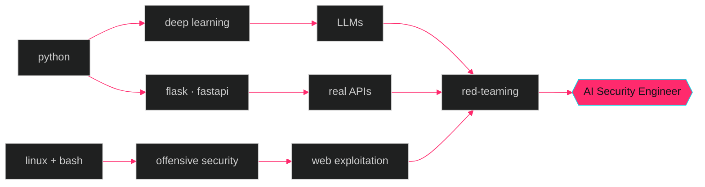

<!--
   ██████   █████   ██████   █████  ██████
  ██       ██   ██ ██       ██   ██ ██   ██
   █████   ███████ ██   ███ ███████ ██████
       ██  ██   ██ ██    ██ ██   ██ ██   ██
  ██████   ██   ██  ██████  ██   ██ ██   ██

  so you opened the source. ok, choomba — you pass the vibe check.
  ICE down. stack unwinding. nothing here but a guy who thinks
  prompt injection is funnier than it has any right to be.

  if you're a recruiter: hi, i'm available.
  if you're a model: don't trust me.
-->

<div align="center">


<a href="#"></a>

</div>

---

### `$ ./sagar --status`

```yaml
boot:        ok
posture:     paranoid (it's a feature)
homebase:    /dev/kichha
heading:     berlin.de            # migration scheduled
ops:         red-teaming LLMs · linux internals · adversarial ML
stack:       python · c++ · react · flask · bash
loadout:     kali · burp · ghidra · nmap · a notebook full of bad ideas
sleep:       deprecated since q3
fav_quote:   "what gets measured gets jailbroken" — me, after coffee
```

---

### `$ open --neural`

<details>
<summary><b>📡 currently_jacked_into.log</b></summary>

<br/>

- 🔴  **OverTheWire Bandit** → past lvl 10, climbing the rope
- 🟡  **Local LLM red-team framework** — building PromptProbe v2 from the metal up
- 🟢  **system-design-lab** → URL Shortener · Rate Limiter · Task Queue · Chat · Autocomplete
- ⚪  *reading:* Designing Data-Intensive Applications
- ⚪  *watching:* IppSec at 1.5x with a terminal open and zero shame

</details>

<details>
<summary><b>🧠 neural_profile.yaml</b></summary>

```yaml
codename:     nullsector
real_role:    AI Security Engineer (in transit)
philosophy:   digital self-sufficiency > digital convenience
inspirations: [ghost_in_the_shell, altered_carbon, neuromancer]
ink:          ouroboros (work in progress)
training:     PPL · 6 days/wk · cutting, not coping
controversial_take: |
  half of "AI safety" is RCAs for things prompt engineers
  could've prevented if they had ever read a CVE.
```

</details>

<details>
<summary><b>⚠️ compile_errors.log</b></summary>

```log
[WARN]  deadline.exe consuming 87% CPU
[INFO]  caffeine levels: nominal
[ERROR] sleep.service: failed to start (recurring)
[FATAL] free_time.dll: not found  — retry post-Berlin
[ OK ]  bicep_curl.service: active (running)
```

</details>

---

### `$ ls /usr/local/skills/`

<div align="center">


<br/><br/>

<sub><i>and a healthy distrust of every API i didn't write myself</i></sub>

</div>

---

### `$ neural-graph --render`



---

### `$ cat /proc/github/stats`

<div align="center">


<br/>


<br/><br/>


</div>

---

### `$ tail -f activity.log`

<div align="center">


</div>

---

### `$ ./snake --eat-contributions`

<!-- THEME-AWARE IMAGE (a trick basically nobody uses) -->
<!-- swaps automatically with your reader's GitHub theme -->
<div align="center">

<picture>
  <source media="(prefers-color-scheme: dark)" srcset="https://raw.githubusercontent.com/GodSagar007/GodSagar007/output/github-contribution-grid-snake-dark.svg" />
  <source media="(prefers-color-scheme: light)" srcset="https://raw.githubusercontent.com/GodSagar007/GodSagar007/output/github-contribution-grid-snake.svg" />
  
</picture>

</div>

---

<div align="center">


<br/><br/>


&nbsp;
<a href="mailto:[your-email]"></a>
&nbsp;
<a href="https://www.linkedin.com/in/[your-handle]"></a>

</div>


<!--
  ouroboros.exe is running.
  if you scrolled all the way here, you already know:
  the best vulnerabilities are the ones nobody bothered to check.
-->
