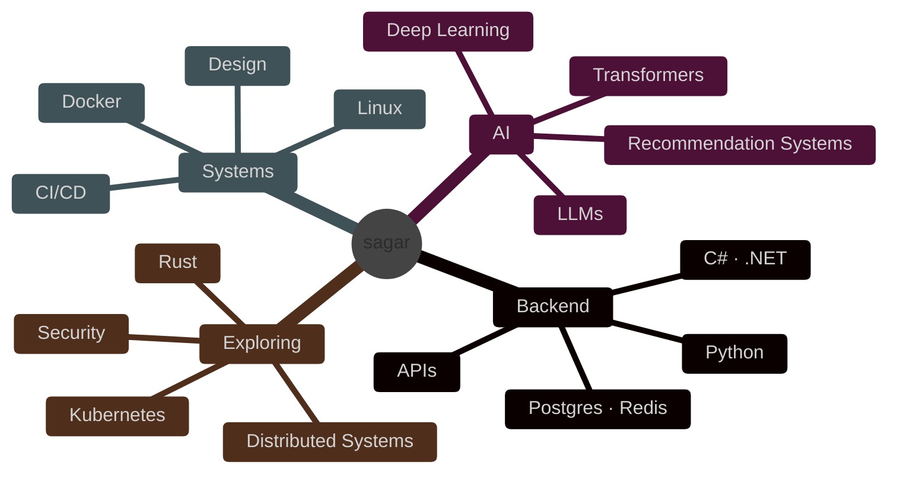

<!--
  if you opened the source:
  respect.

  building > posturing.
-->

<div align="center">


<br/>


</div>

---

```yaml
education: B.Tech, Artificial Intelligence

focus:
  - backend systems
  - ai engineering
  - scalable applications
  - infrastructure & design

approach:
  - build fast
  - understand deeply
  - keep shipping

currently:
  - system design
  - distributed systems
  - local llm experimentation
  - security fundamentals

quote:
  "the best work is the work nobody asked you to do."
```

```txt
core/
├── Python
├── C#
├── SQL
├── TypeScript
└── Bash

backend/
├── FastAPI
├── Flask
├── .NET
├── REST APIs
├── PostgreSQL
└── Redis

ai_ml/
├── PyTorch
├── TensorFlow
├── Transformers
├── Scikit-learn
└── LangChain

systems/
├── Docker
├── Linux
├── Git
├── CI/CD
└── System Design

learning/
├── Rust
├── Kubernetes
├── Security
└── Distributed Systems
```

<div align="center">


</div>



<details>
<summary><b>📦 active_projects</b></summary>

<br/>

```txt
[01] system-design-lab
     └─ URL Shortener
     └─ Rate Limiter
     └─ Task Queue
     └─ Chat System
     └─ Autocomplete Engine

[02] recommendation-system
     └─ real-time product recommendations
     └─ api + deployment pipeline
     └─ experimentation with ranking systems

[03] local-llm-lab
     └─ inference experiments
     └─ agents & tooling
     └─ model orchestration
```

</details>

```txt
good engineering scales beyond code.

understand systems.
read the docs.
measure things.
ship anyway.
improve continuously.
```

<div align="center">


<br/><br/>

<picture>
  <source media="(prefers-color-scheme: dark)" srcset="https://raw.githubusercontent.com/GodSagar007/GodSagar007/output/github-contribution-grid-snake-dark.svg" />
  <source media="(prefers-color-scheme: light)" srcset="https://raw.githubusercontent.com/GodSagar007/GodSagar007/output/github-contribution-grid-snake.svg" />
  
</picture>

<br/><br/>


<br/><br/>

<i>"the best work is the work nobody asked you to do."</i>

</div>


<!--
  still learning.
  still building.
-->
