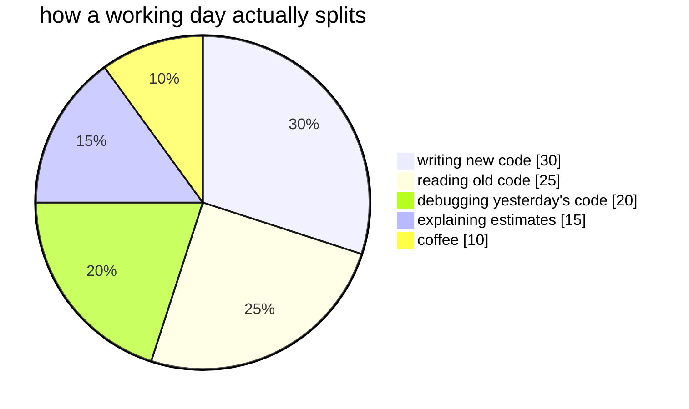

<!--
  there's not much here. that's the point.
  the work is pinned below — talk is cheap; commits less so.
-->

<h2 align="center">hey, i'm sagar 👋</h2>

  

  <picture>
    <source media="(prefers-color-scheme: dark)" srcset="https://raw.githubusercontent.com/GodSagar007/GodSagar007/output/github-contribution-grid-snake-dark.svg" />
    <source media="(prefers-color-scheme: light)" srcset="https://raw.githubusercontent.com/GodSagar007/GodSagar007/output/github-contribution-grid-snake.svg" />
    
  </picture>

  <i>"what gets measured gets improved." — peter drucker</i>
    
  📌 the actual work is pinned below ↓

